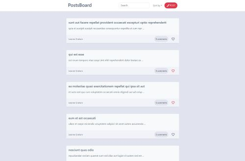

# REACT-POSTS-APP

PostsBoard is a single page web application built with React that allows users to view, search, and interact with posts.

https://violetlebird.github.io/React-Posts-App/

## Features

- View a list of posts with details such as title and body
- Sort posts alphabetically (A-Z and Z-A)
- Search for posts by entering keywords
- Open a modal to view a detailed post, including comments
- Like posts

## Deploying

For deploying this application is used Vite.
You can use any other deployment software that supports React.
